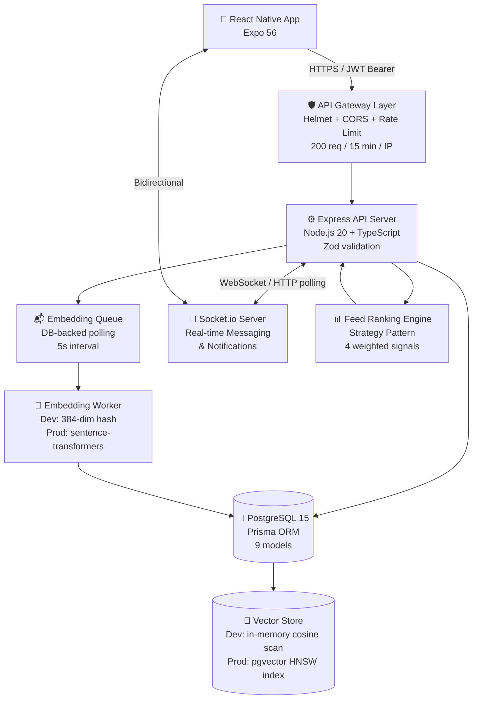
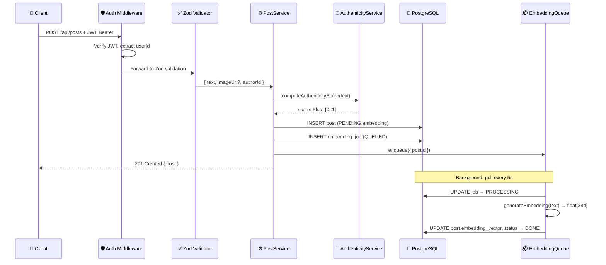
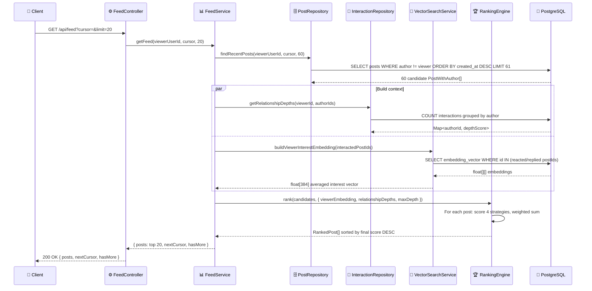
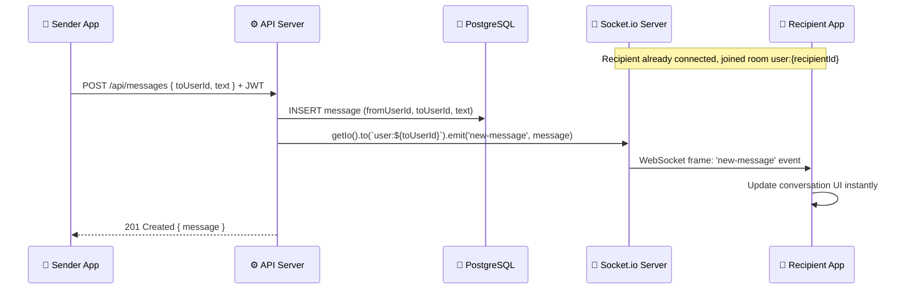
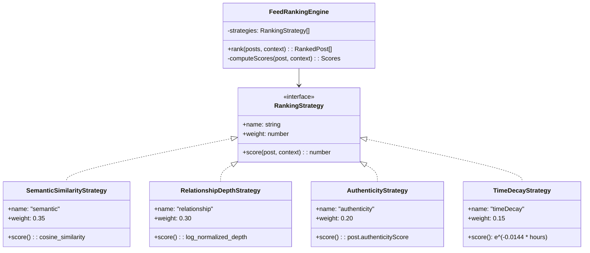

# 🏗️ High Level Design — Guised Up Real Connections Feed

---

## 1. Executive Summary

**Guised Up** is a mobile-first social platform built around the principle that authentic human connection matters more than algorithmic engagement maximization. Where Instagram optimizes for time-on-app and Twitter (X) optimizes for virality and outrage, Guised Up optimizes for **depth of relationship** and **authenticity of content**.

The core product is the **Real Connections Feed** — a ranked feed that surfaces posts from people you genuinely interact with, ordered not purely by recency or like counts, but by a composite score that weighs:

- How **semantically aligned** a post is with your demonstrated interests
- How **deeply connected** you are with the author
- How **authentic** the post content appears (vs. marketing-speak or spam)
- How **recent** the post is (with a 48-hour half-life decay)

This stands in contrast to mainstream platforms where:
- A post from a close friend with 5 likes loses to a viral post from a stranger with 50,000 likes
- Polished, promotional content is rewarded over raw, personal expression
- Your feed is shaped by advertiser interests, not relationship depth

---

## 2. System Objectives

### 2.1 Functional Goals

| # | Goal | Description |
|---|------|-------------|
| F1 | Authenticated social graph | Users register, log in, and have a persistent identity with JWT-based auth |
| F2 | Post creation & management | Create text + image posts, edit, delete |
| F3 | Ranked feed | GET /feed returns posts ranked by a composite 4-signal algorithm |
| F4 | Semantic search | Full-text + vector similarity search over all posts |
| F5 | Real-time messaging | Direct messages delivered via Socket.io without polling |
| F6 | Notification system | Push-style in-app notifications for comments, reactions, mentions, messages |
| F7 | Social interactions | Reactions, replies, and view tracking — feeds relationship depth signal |
| F8 | Embedding pipeline | Background worker generates 384-dim text embeddings for every post |

### 2.2 Non-Functional Goals

| # | Goal | Target |
|---|------|--------|
| NF1 | Feed API latency | p99 < 500ms (MVP, single node) |
| NF2 | Auth API latency | p99 < 100ms |
| NF3 | Message delivery | < 200ms end-to-end on stable connection |
| NF4 | Embedding throughput | Process backlog at ≥ 12 posts/min (5s poll, batch of 5) |
| NF5 | Security | OWASP Top 10 mitigated: input validation, parameterized queries, rate limiting, secure headers |
| NF6 | Scale target (MVP) | Comfortably serve 1,000 concurrent users on a single VPS |
| NF7 | Availability | Single-node MVP; graceful shutdown, DB-backed durable job queue |

---

## 3. High Level Architecture

### 3.1 System Components



### 3.2 Data Flow: Create Post

**Steps:**

1. Client sends `POST /api/posts` with JWT in `Authorization: Bearer <token>` header and `{ text, imageUrl? }` body
2. Express `authenticate` middleware extracts `JwtPayload { userId, email, username }` from the token
3. Zod `createPostSchema` validates body (`text`: 1–2000 chars, `imageUrl`: valid URL or base64 data URI)
4. `postService.createPost` is invoked:
   - a. `AuthenticityService` computes an authenticity score at **write time** using heuristics (personal pronouns ratio, lowercase ratio, content length, hashtag spam detection)
   - b. `postRepository.create` persists the post to PostgreSQL with `embeddingStatus: PENDING`
   - c. An `EmbeddingJob` row is inserted with status `QUEUED`
   - d. `embeddingQueue.enqueue({ postId })` signals the background worker
5. `201 Created` is returned to the client immediately — the embedding runs asynchronously



### 3.3 Data Flow: Get Feed

**Steps:**

1. Client sends `GET /api/feed?cursor=<uuid>&limit=20` with JWT
2. Middleware authenticates; `feedController` delegates to `feedService.getFeed(viewerUserId, cursor, limit)`
3. `postRepository.findRecentPosts` fetches `limit × 3 = 60` candidate posts from ALL other users (open candidate pool enables discovery)
4. In parallel:
   - `interactionRepository.getRelationshipDepths(viewerUserId, authorIds)` — counts interactions between viewer and each post author
   - `vectorSearchService.buildViewerInterestEmbedding(interactedPostIds)` — averages embeddings of posts the viewer has reacted/replied to
5. `feedRankingEngine.rank(candidates, context)` scores every candidate with 4 strategies and sorts descending
6. Top `limit` posts returned with cursor for next page



### 3.4 Data Flow: Real-time Message



---

## 4. Component Responsibilities

### 4.1 🖥️ API Server

**Responsibilities:**
- Route all HTTP traffic through a single versioned base path `/api`
- Enforce rate limiting (200 req/15 min/IP via `express-rate-limit`)
- Apply security headers via `helmet` (CSP, HSTS, X-Frame-Options, etc.)
- Authenticate every protected route via the `authenticate` middleware (JWT extraction from `Authorization: Bearer` header)
- Validate request bodies and query params via Zod schemas before touching service layer
- Serve Swagger UI at `/api/docs` for interactive API documentation
- Handle structured error responses and 404s via global error middleware
- Log all HTTP requests via Winston + Morgan

**What it does NOT do:**
- Does not store sessions (stateless — all state in JWT + DB)
- Does not process embeddings inline (delegated to background queue)
- Does not manage WebSocket connections (Socket.io runs alongside on the same HTTP server)

### 4.2 📊 Feed Ranking Engine

The ranking engine implements the **Strategy Pattern** — each scoring signal is a separate injectable class implementing the `RankingStrategy` interface.



**Final score formula:**

```
score = (0.35 × semantic) + (0.30 × relationship) + (0.20 × authenticity) + (0.15 × timeDecay)
```

| Strategy | Weight | Signal | Cold-start Handling |
|----------|--------|--------|---------------------|
| SemanticSimilarity | 0.35 | Cosine similarity between post embedding and viewer's averaged interest embedding | Returns 0 if viewer has no interactions yet |
| RelationshipDepth | 0.30 | `log(1 + interactions) / log(1 + maxInteractions)` normalized | Cold-start score: 0.1 |
| Authenticity | 0.20 | Pre-computed at write time: pronouns, lowercase ratio, length, hashtag density | Reads `post.authenticityScore` column directly |
| TimeDecay | 0.15 | `e^(-0.0144 × hoursElapsed)` → 48-hour half-life | Always computable |

### 4.3 🤖 Embedding Pipeline

```
POST /api/posts
      │
      ▼
PostService.createPost()
      │  ① Compute authenticityScore (synchronous)
      │  ② INSERT post with embeddingStatus=PENDING
      │  ③ INSERT EmbeddingJob with status=QUEUED
      │  ④ embeddingQueue.enqueue({ postId })
      ▼
201 Created → Client

[Background, every 5s]
EmbeddingQueue.processBatch()
      │  ① Query DB for QUEUED jobs (batch of 5)
      │  ② UPDATE job → PROCESSING
      ▼
EmbeddingService.generateEmbedding(text)
      │  Dev:  deterministic 384-dim hash (no external calls)
      │  Prod: sentence-transformers (Python sidecar or local model)
      ▼
postRepository.updateEmbedding(postId, vector, "DONE")
embeddingJobRepository.updateStatus(postId, "DONE")
```

The `EmbeddingJob` table provides **durability**: if the Node.js process crashes mid-batch, jobs remain `QUEUED` or `PROCESSING` in PostgreSQL and are automatically retried on the next worker startup.

### 4.4 🔌 Socket.io Real-time Layer

**Authentication:** Every Socket.io connection must pass a JWT in `socket.handshake.auth.token`. The server's middleware verifies the token against `JWT_SECRET` and attaches `userId` and `username` to `socket.data`. Unauthenticated connections are rejected with `Error("Unauthorized")`.

**Room Management:**

| Room | Joined | Purpose |
|------|--------|---------|
| `user:${userId}` | Automatically on connect | Receive DMs and notifications targeted to this user |
| `post:${postId}` | Client emits `join-post` | Receive real-time comment/reaction updates for a specific post |

**Events:**

| Event | Direction | Payload | Trigger |
|-------|-----------|---------|---------|
| `new-message` | Server → Client | `{ message }` | When a DM is sent via REST API |
| `notification` | Server → Client | `{ notification }` | Comment, reaction, mention, message events |
| `join-post` | Client → Server | `postId: string` | Client opens a post detail view |
| `leave-post` | Client → Server | `postId: string` | Client closes a post detail view |
| `disconnect` | System | — | Connection dropped |

### 4.5 📱 Frontend App

The React Native + Expo 56 app is organized as:

**Navigation Structure:**
```
RootNavigator (React Navigation v7)
  └── AuthStack (unauthenticated)
        ├── LoginScreen
        └── RegisterScreen
  └── MainTabs (authenticated, Bottom Tab Navigator)
        ├── FeedScreen        ← Ranked feed, filter chips (for you / trending / recent)
        ├── SearchScreen      ← Semantic + text search
        ├── CreateScreen      ← Create post with expo-image-picker
        ├── MessagesScreen    ← DM conversations
        └── ProfileScreen     ← User profile + post history
```

**React Contexts:**
- `AuthContext` — JWT tokens, user identity, login/logout
- `SocketContext` — Socket.io client instance, connection lifecycle
- `ThemeContext` — Dark/light mode color tokens

**API Services:**
- `feedApi` — GET /feed with cursor pagination
- `postApi` — CRUD for posts
- `authApi` — register, login, refresh
- `notificationApi` — list and mark-read notifications
- `messageApi` — DM conversations
- `searchApi` — semantic + text search

**Client-side Feed Filters** (no extra API call):
- **For you** — uses server-ranked order (default)
- **Trending** — client sorts by `post._count.interactions` descending
- **Recent** — client sorts by `post.createdAt` descending

---

## 5. Technology Choices & Rationale

| Component | Choice | Why | Alternative Considered |
|-----------|--------|-----|----------------------|
| Backend runtime | Node.js 20 + TypeScript | Type safety across full stack, fast async I/O for API workloads, huge ecosystem | Laravel PHP (evaluated briefly, poor RN ecosystem fit) |
| Database | PostgreSQL 15 | ACID transactions, full-text search, `pgvector` extension for native vector ops, JSON support | MySQL (no vector extension support) |
| Vector DB | pgvector (production) | Same Postgres instance = zero extra infra at MVP scale, HNSW index for sub-linear search | Pinecone, Qdrant (added operational complexity) |
| Auth | JWT (15m) + Refresh Token rotation (7d) | Stateless access tokens work with any number of API instances; refresh rotation detects token theft | Server sessions (require sticky routing or Redis session store) |
| ORM | Prisma | Type-safe generated client, auto-migrations, readable schema DSL, native UUID + enum support | TypeORM (verbose), raw SQL (no type safety) |
| Validation | Zod | Runtime type narrowing matches TypeScript types exactly; schema reuse across layers | Joi (no TS inference), class-validator (decorator coupling) |
| Real-time | Socket.io | Handles WebSocket with HTTP long-polling fallback; rooms and namespaces built-in | Raw WebSocket (no fallback, no room management) |
| Embeddings | 384-dim deterministic hash (dev) → sentence-transformers (prod) | Free, MIT license, runs locally, 384 dimensions fits pgvector HNSW well | OpenAI `text-embedding-3-small` (paid, external dependency) |
| Job queue | DB-backed polling (dev) → BullMQ + Redis (prod) | Zero extra dependencies in dev; swap path to BullMQ is clearly documented in code | SQS, RabbitMQ (over-engineered for MVP) |
| Logging | Winston | Structured JSON logging, configurable transports, log levels | Pino (similar), `console.log` (no levels, no transports) |
| API docs | Swagger UI (OpenAPI 3.0) | Self-documenting, interactive, standard format | Postman collections (not in-repo) |

---

## 6. Scalability Plan

### 🟢 Current (MVP — up to ~1,000 concurrent users)

**What the current architecture supports:**
- Single Node.js process (Express + Socket.io on the same server)
- Single PostgreSQL instance
- In-process embedding queue (DB-backed, no Redis)
- In-memory cosine similarity scan for vector search
- No cache layer

**Bottlenecks at this scale:** CPU-bound ranking for large candidate sets; memory-bound vector scan if post count exceeds ~100k

### 🟡 Phase 2 (10k–100k users)

- **Redis cache** for hot feed results (5-minute TTL per user)
- **BullMQ + Redis** replaces the in-process queue — enables multiple worker processes and job retries with backoff
- **PostgreSQL read replica** for feed queries (writes to primary, reads to replica)
- **pgvector HNSW index** enabled in production (replaces in-memory scan)
- **CDN (Cloudflare/CloudFront)** for image delivery
- Horizontal scaling of the API server behind a load balancer (JWT is stateless — no sticky routing needed; Socket.io requires Redis adapter for cross-instance pub/sub)

### 🟠 Phase 3 (100k–10M users)

- **Socket.io Redis Adapter** — broadcasts across multiple API instances
- **Dedicated embedding service** — Python microservice running `sentence-transformers` with GPU acceleration, consuming from BullMQ
- **Separate read/write DB** with connection pooling via PgBouncer
- **Vector DB evaluation** — Qdrant or dedicated pgvector cluster if post count > 50M
- **Pre-computed feed cache** — background job pre-ranks feed for active users every N minutes

### 🔴 Phase 4 (10M+ users)

- **Microservices split** — Feed service, Messaging service, Notification service, Auth service, Embedding service as independent deployments
- **Event-driven architecture** — Kafka or Pulsar for cross-service communication (post created → trigger embedding → trigger feed invalidation)
- **Sharding strategy** — Shard PostgreSQL by `user_id` hash for posts and interactions
- **Dedicated vector database** — Separate Qdrant or Weaviate cluster with ~1B vector capacity

---

## 7. Security Model

| Layer | Control | Implementation |
|-------|---------|----------------|
| 🌐 Network | HTTPS only | TLS termination at reverse proxy (Nginx + Let's Encrypt) |
| 🛡️ Headers | Security headers | `helmet()` middleware — CSP, HSTS, X-Content-Type-Options, X-Frame-Options |
| 🔑 Authentication | Short-lived JWTs | 15-minute access token TTL; refresh token rotation (7d) detects replay attacks |
| 🚦 Rate limiting | 200 req/15min/IP | `express-rate-limit` on all `/api/*` routes |
| ✅ Input validation | Zod schemas | Every endpoint has a typed schema; validation errors return structured 422 |
| 🗄️ Database | Parameterized queries | Prisma's query builder never interpolates raw SQL → no injection risk |
| 🔐 Passwords | bcrypt | 12 rounds; never stored in plaintext; never returned in API responses |
| 🔄 CORS | Configurable origin | `CORS_ORIGIN` env var; defaults to `*` in dev, must be explicit in production |
| 🔏 Token storage | Refresh tokens in DB | Stored with `expiresAt` and `revoked` flag; rotation invalidates old tokens |

---

## 8. Trade-offs & Constraints

| Decision | Trade-off Accepted | Rationale |
|----------|--------------------|-----------|
| Monolith over microservices | Harder to scale individual components independently | Far simpler to build, deploy, and debug at MVP scale |
| DB-backed queue over Redis | Queue throughput limited by Postgres write IOPS | Eliminates Redis dependency in development; clear swap path documented in code |
| In-memory vector scan in dev | Scans all embedded posts linearly — slow at scale | No pgvector setup required to run locally; HNSW index ready in schema for prod |
| Authenticity computed at write time | Editing a post does not re-compute score | Avoids real-time ML inference on every feed request; score is good enough at creation time |
| Open candidate pool (all users) | Feed candidates not limited to followed users | Enables discovery for new users with no social graph; relationship signal naturally boosts close connections |
| Client-side filter sorting | Trending/recent filters re-sort already-fetched data | Avoids extra API round-trips; acceptable because feed is paginated and post count per page is small |
| `embeddingVector` stored as JSON string | Cannot use native Postgres vector operators | Works identically to pgvector in dev; production migration path documented |

---

## 9. Future Architecture Considerations

- **Personalization signals expansion** — Today's 4 signals are a strong baseline. Future signals could include: save/bookmark rate, share rate, session dwell time per post, and explicit user-provided interest tags.

- **Real-time feed push** — Instead of polling + paginated pull, a future architecture could maintain a persistent Socket.io connection that pushes newly ranked posts to the client's feed in real time as they arrive (similar to Twitter's streaming API).

- **A/B testing framework** — The Strategy Pattern in `FeedRankingEngine` is already designed for this: weights and strategies can be injected per-user based on experiment assignment, with score attribution logged for offline analysis.

- **Content moderation pipeline** — As the platform scales, a background classifier (hate speech, spam, NSFW) should run alongside the embedding worker, adding a `moderationStatus` field and routing flagged posts to human review before they appear in feeds.
