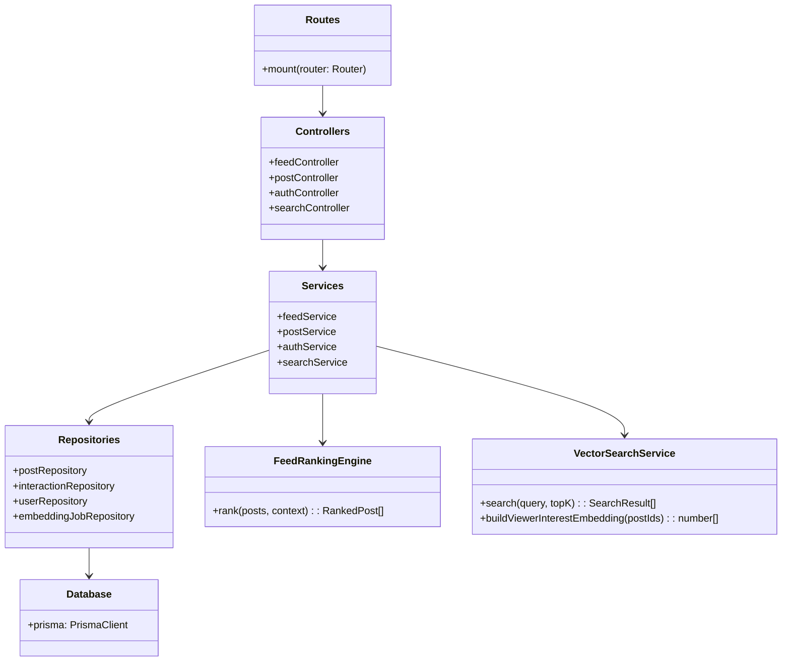
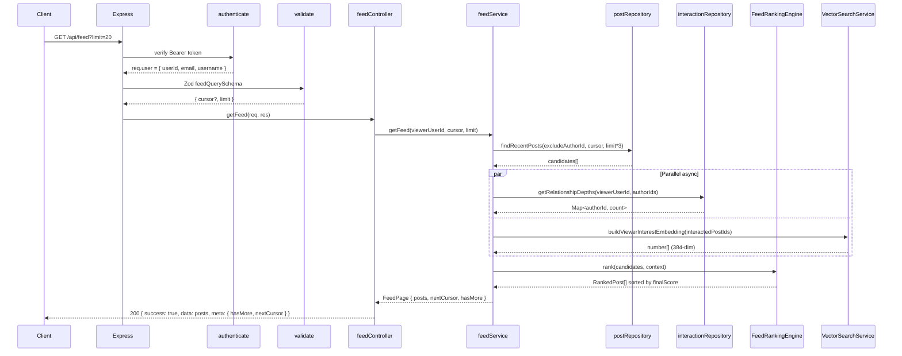
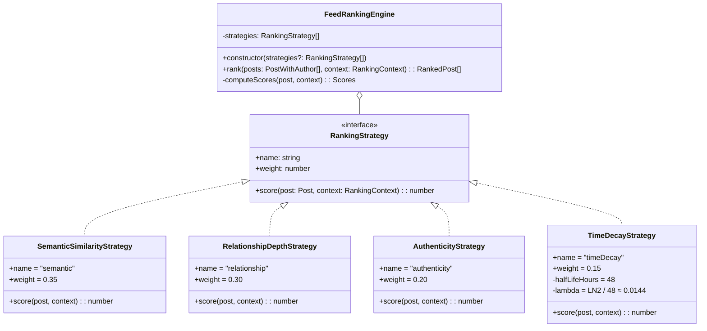
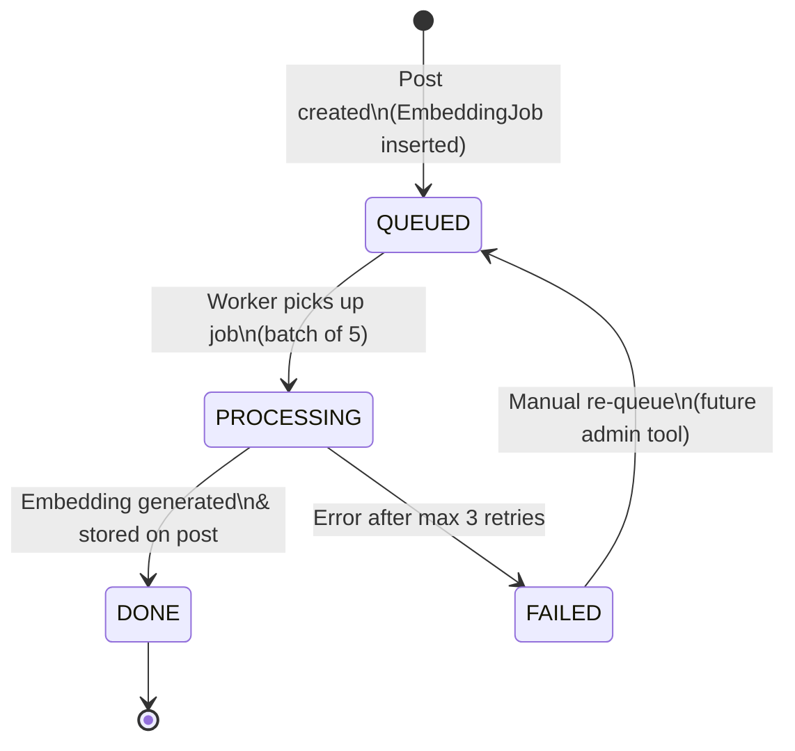
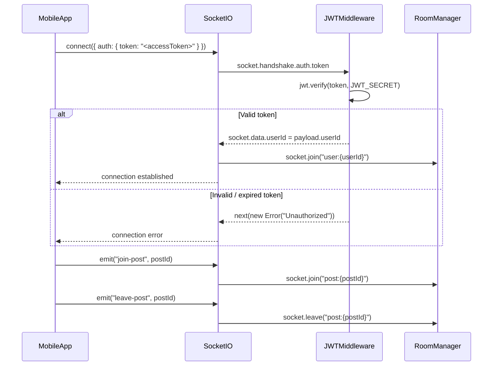
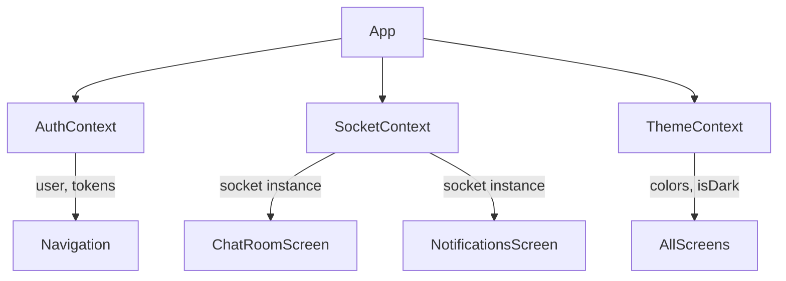
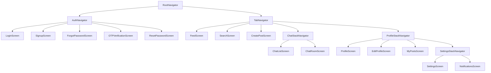

# 🔬 Low Level Design — Guised Up Real Connections Feed

> **Document scope:** Code-level design of the Guised Up backend (Node.js/Express/Prisma) and React Native frontend. Covers architecture layers, feed ranking engine, embedding pipeline, real-time layer, frontend state management, and testing strategy.

---

## 1. Introduction

This document describes the Low Level Design (LLD) of the Guised Up "Real Connections Feed" assessment project. It is intended for engineers who need to understand the code-level structure, data flows, and design decisions without reading every source file.

**What this document covers:**
- Backend layered architecture (Routes → Controllers → Services → Repositories → Database)
- Feed ranking engine using the Strategy Pattern with 4 independent signals
- Asynchronous embedding pipeline with DB-backed job queue
- Real-time messaging via Socket.io
- Frontend state management, API client design, and navigation architecture
- Data validation strategy (Zod on backend, react-hook-form + Zod on frontend)
- Testing architecture (unit + integration)

**Out of scope:** Infrastructure provisioning, CI/CD pipelines, database migrations.

---

## 2. Backend Architecture

### 2.1 Layered Architecture

The backend follows a strict 5-layer separation of concerns. Each layer depends only on the layer directly below it — no layer skipping.

```
┌─────────────────────────────────────────────────────────┐
│                      HTTP Client                        │
└───────────────────────────┬─────────────────────────────┘
                            │
┌───────────────────────────▼─────────────────────────────┐
│                  Routes (Express Router)                 │
│   authRoutes, postRoutes, feedRoutes, searchRoutes …    │
│   Mounted at /api via routes/index.ts                   │
└───────────────────────────┬─────────────────────────────┘
                            │
┌───────────────────────────▼─────────────────────────────┐
│              Middleware Pipeline                         │
│   authenticate (JWT) → validate (Zod) → controller      │
└───────────────────────────┬─────────────────────────────┘
                            │
┌───────────────────────────▼─────────────────────────────┐
│                    Controllers                           │
│   Parse req → call service → send response              │
│   Never access DB directly; never contain business logic │
└───────────────────────────┬─────────────────────────────┘
                            │
┌───────────────────────────▼─────────────────────────────┐
│                     Services                            │
│   Orchestrate repositories; own business rules           │
│   feedService: candidate fetch → rank → paginate        │
└───────────────────────────┬─────────────────────────────┘
                            │
┌───────────────────────────▼─────────────────────────────┐
│                   Repositories                          │
│   Prisma queries only; no business logic                │
│   postRepository, interactionRepository, …              │
└───────────────────────────┬─────────────────────────────┘
                            │
┌───────────────────────────▼─────────────────────────────┐
│              PostgreSQL (via Prisma ORM)                 │
└─────────────────────────────────────────────────────────┘
```

**Mermaid class diagram — dependency graph:**



### 2.2 Request Lifecycle



### 2.3 Error Handling Strategy

All errors are expressed as instances of `AppError` (or its subclasses). The global error handler in `middleware/errorHandler.ts` is the single exit point for all errors.

**Error class hierarchy:**

```
AppError (base)
├── NotFoundError          → 404
├── UnauthorizedError      → 401
├── ForbiddenError         → 403
├── ConflictError          → 409
├── ValidationError        → 422
└── BadRequestError        → 400
```

**How errors propagate:**

1. A service or controller throws `new NotFoundError("Post")` or `new UnauthorizedError("Token expired")`.
2. Express passes the error to `globalErrorHandler` via `next(err)`.
3. The handler checks `err instanceof AppError` → calls `sendError(res, err.message, err.statusCode)`.
4. Prisma-specific errors (P2002 duplicate, P2025 not found) are caught and mapped to 409 / 404.
5. All other errors → 500 (`"Internal server error"` in production, raw `err.message` in dev).

**Response envelope for errors:**
```json
{ "success": false, "error": "Post not found" }
```

### 2.4 Authentication Flow (Detailed)

**Token generation (`middleware/auth.ts`):**

```typescript
// Access token — short-lived, carries identity
export function generateAccessToken(payload: JwtPayload): string {
  return jwt.sign(payload, env.JWT_SECRET, { expiresIn: env.JWT_EXPIRES_IN });
}

// Refresh token — long-lived, used only to obtain new access tokens
export function generateRefreshToken(payload: JwtPayload): string {
  return jwt.sign(payload, env.JWT_REFRESH_SECRET, { expiresIn: env.JWT_REFRESH_EXPIRES_IN });
}
```

**Authentication middleware flow:**

```mermaid
sequenceDiagram
    participant Request
    participant authenticate
    participant jwt

    Request->>authenticate: Authorization: Bearer <token>
    authenticate->>jwt: verify(token, JWT_SECRET)
    alt Token valid
        jwt-->>authenticate: JwtPayload { userId, email, username }
        authenticate->>Request: req.user = payload; next()
    else Token expired
        jwt-->>authenticate: TokenExpiredError
        authenticate->>Request: next(new UnauthorizedError("Token expired"))
    else Token invalid
        jwt-->>authenticate: JsonWebTokenError
        authenticate->>Request: next(new UnauthorizedError("Invalid token"))
    end
```

**Refresh token rotation (frontend `apiClient.ts`):**

The Axios response interceptor implements a request queue to prevent parallel 401 → refresh → retry races:

```typescript
// When a 401 arrives and isRefreshing is already true:
// → new request is queued (not sent)
// → waits for the in-flight refresh to resolve/reject
// → queue is flushed with the new token (processQueue)

let isRefreshing = false;
let failedQueue: Array<{ resolve: (token: string) => void; reject: (err: unknown) => void }> = [];

// On 401:
if (isRefreshing) {
  return new Promise((resolve, reject) => {
    failedQueue.push({ resolve, reject });   // queue this request
  }).then(token => {
    originalRequest.headers.Authorization = `Bearer ${token}`;
    return client(originalRequest);          // retry with new token
  });
}

isRefreshing = true;
// ... call /auth/refresh ...
// on success: processQueue(null, newAccessToken)
// on failure: processQueue(refreshError, null) → authEventEmitter.emit('logout')
```

If refresh fails, `authEventEmitter.emit('logout')` propagates the forced logout to the navigation layer without tight coupling between `apiClient` and React Navigation.

---

## 3. Feed Ranking Engine (Detailed)

### 3.1 Class Diagram



### 3.2 FeedRankingEngine

`FeedRankingEngine` (`backend/src/ranking/FeedRankingEngine.ts`) is the orchestrator. It:

1. Accepts an ordered list of `RankingStrategy` instances (injectable via constructor for testing).
2. Validates that strategy weights sum to 1.0 (warns via logger if not).
3. For each candidate post, calls `strategy.score(post, context)` for all strategies.
4. Clamps each raw score to `[0, 1]` before applying the weight.
5. Computes the weighted sum as `finalScore`.
6. Returns posts sorted descending by `finalScore`.

**Weight validation at construction time:**
```typescript
const totalWeight = this.strategies.reduce((sum, s) => sum + s.weight, 0);
if (Math.abs(totalWeight - 1.0) > 0.01) {
  logger.warn(`Ranking strategy weights sum to ${totalWeight}, expected 1.0`);
}
```

This makes it safe to inject custom strategy sets during unit tests without silently producing wrong scores.

### 3.3 Strategy: SemanticSimilarityStrategy

**Weight:** 0.35 — highest, because topic relevance is the primary signal.

**How it works:**

1. The viewer's interest embedding is built by averaging the embeddings of posts they have REACTED to or REPLIED to (up to 50 most recent interactions).
2. The post's embedding is deserialized from the stored JSON vector.
3. Cosine similarity is computed between the two vectors and normalized from `[-1, 1]` to `[0, 1]`.

**Cosine similarity formula:**

```
similarity(a, b) = dot(a, b) / (|a| × |b|)

normalized_to_[0,1] = (similarity + 1) / 2
```

**Cold start:** If `viewerEmbedding.length === 0` (new user with no interactions), the strategy returns `0.5` — a neutral score that doesn't bias against any post.

**Pseudocode:**
```
function score(post, context):
  if post.embeddingVector is null OR context.viewerEmbedding is empty:
    return 0.5  // neutral fallback

  postVector = deserialize(post.embeddingVector)
  sim = cosineSimilarity(postVector, context.viewerEmbedding)
  // sim already normalized to [0,1] by EmbeddingService
  return clamp(sim, 0, 1)
```

### 3.4 Strategy: RelationshipDepthStrategy

**Weight:** 0.30 — second highest, because genuine engagement history is the product's core value proposition.

**What "depth" means:** The total number of interactions (any type: VIEW, REPLY, REACTION) the viewer has performed on any post authored by this author.

**Log normalization formula:**

```
logDepth  = LN(1 + rawDepth)
logMax    = LN(1 + maxDepthAcrossAllCandidates)
score     = logDepth / logMax
```

Using `log1p` instead of a linear ratio prevents an obsessive fan (500 interactions) from dominating all other authors completely.

**Cold start:** If `rawDepth === 0` the strategy returns `0.1` — a small positive bias that keeps new authors visible instead of invisible.

**Example scores:**

| Interaction count | Score (assuming max=100) |
|:-----------------:|:------------------------:|
| 0 (new author)    | 0.10 (cold start)        |
| 1                 | ~0.14                    |
| 5                 | ~0.29                    |
| 10                | ~0.38                    |
| 50                | ~0.68                    |
| 100               | 1.00 (the max)           |

### 3.5 Strategy: AuthenticityStrategy

**Weight:** 0.20 — third, because authenticity is the brand differentiator.

The score is **pre-computed at write time** by `computeAuthenticityScore()` and stored in the `authenticityScore` column. At read time, the strategy simply reads `post.authenticityScore` — O(1), no text processing during ranking.

**Heuristic signal table:**

| Signal | Direction | Points | Rationale |
|--------|-----------|-------:|-----------|
| Personal pronouns (I, me, my, we, us, our) | Positive | +0.15 | First-person voice signals personal experience |
| All-lowercase text | Positive | +0.05 | Casual tone; less polished/marketing |
| Reasonable length (3–150 words) | Positive | +0.10 | Not too short (empty), not too long (essay) |
| Question mark present | Positive | +0.05 | Genuine curiosity / conversation starter |
| Ellipsis (…) present | Positive | +0.03 | Conversational trailing thought |
| No image attached | Positive | +0.07 | Raw text = more personal |
| >5 hashtags | Negative | −0.20 | Strong signal of marketing/reach-seeking |
| >3 words ALL CAPS (len > 3) | Negative | −0.15 | Shouting; sensationalist tone |
| Stock image URL (unsplash, shutterstock, gettyimages, stockphoto) | Negative | −0.15 | Polished/curated image = less authentic |

**Base score:** 0.50, clamped to `[0.1, 1.0]` after applying all signals.

**Note:** The clamp minimum is 0.1 rather than 0.0 — even a very inauthentic post keeps a tiny score, ensuring it still has a chance to appear if other signals are very strong.

### 3.6 Strategy: TimeDecayStrategy

**Weight:** 0.15 — lowest, because relevance and relationship matter more than raw recency.

**Formula:**

```
λ = LN(2) / 48 ≈ 0.01443

score(t) = e^(-λ × hoursElapsed)
```

**Why 48-hour half-life?** A 24-hour half-life would make yesterday's posts nearly invisible. A 7-day half-life would let very old posts compete equally with fresh ones. 48 hours balances recency with relevance — a post from 2 days ago still earns 50% of a brand-new post's time score, but a 30-day-old post scores near zero.

**Decay table:**

| Age | Score |
|:----|------:|
| 1 hour | 0.986 |
| 6 hours | 0.919 |
| 12 hours | 0.843 |
| 24 hours | 0.712 |
| 48 hours | 0.500 |
| 4 days | 0.250 |
| 7 days | 0.082 |
| 14 days | 0.007 |
| 30 days | ~0.0001 |

---

## 4. Embedding Pipeline (Detailed)

### 4.1 State Machine

Each post's embedding moves through states stored in `embeddingStatus` (Prisma enum `EmbeddingStatus`):



Both the `Post.embeddingStatus` column and the `EmbeddingJob.status` column are kept in sync during each transition. If the process crashes mid-processing, the `EmbeddingJob` row remains in `PROCESSING` state and is treated as a stale job on restart (future improvement: add a `lockedAt` timeout).

### 4.2 Background Worker

File: `backend/src/jobs/embeddingQueue.ts`

```
startWorker():
  every 5000ms:
    if isProcessing: skip (no-op, prevents overlap)
    isProcessing = true
    
    jobs = findPendingJobs(limit=5)  // QUEUED status
    
    for each job (in parallel via Promise.allSettled):
      updateStatus(job.postId, PROCESSING)
      post = findById(job.postId)
      vector = embeddingService.generateEmbedding(post.text)
      serialized = JSON.stringify(vector)
      updateEmbedding(post.id, serialized, DONE)
      updateJobStatus(job.postId, DONE)
    
    isProcessing = false
```

**Key design decisions:**
- `Promise.allSettled` (not `Promise.all`) ensures one failed job doesn't block others in the batch.
- `isProcessing` guard prevents the 5-second interval from starting a second batch before the first finishes.
- The `EmbeddingJob` table in Postgres acts as a durable queue — if the Node process crashes, jobs survive and are retried on restart.
- Max 3 retries tracked via `EmbeddingJob.retryCount` (enforced in `embeddingJobRepository`).

### 4.3 Mock vs Production

`EmbeddingService` uses a **deterministic hash** in the current implementation:

```
generateEmbedding(text):
  normalized = text.toLowerCase().trim()
  for each char in normalized:
    idx = (i * 31 + charCode) % DIMENSION
    vector[idx] = (vector[idx] + sin(charCode * (i+1) * 0.1)) / 2
  return L2_normalize(vector)
```

**Same input → same output always** — this makes tests deterministic and cosine similarity meaningful even without a real model.

**Production swap options (documented in source):**

| Provider | Replacement code |
|----------|-----------------|
| OpenAI `text-embedding-3-small` | `openai.embeddings.create({ model: "text-embedding-3-small", input: text })` |
| Python sentence-transformers | `fetch(PYTHON_SERVICE_URL + "/embed", { body: JSON.stringify({ text }) })` |
| pgvector (DB-native) | Store vector as `vector(384)` column; use `<=>` operator for ANN search |

The interface (`generateEmbedding`, `cosineSimilarity`, `serialize`, `deserialize`) stays identical — only the implementation body changes.

---

## 5. Real-time Architecture (Socket.io)

### 5.1 Connection Flow

File: `backend/src/socket/index.ts`



### 5.2 Room Strategy

| Room name | Purpose | Joined automatically? |
|-----------|---------|----------------------|
| `user:{userId}` | Private messages, notifications, friend requests | Yes — on connection |
| `post:{postId}` | Post-level events (comments, reactions) | No — client sends `join-post` |

### 5.3 Event Catalog

| Direction | Event | Payload | Description |
|-----------|-------|---------|-------------|
| Client → Server | `join-post` | `postId: string` | Subscribe to post room |
| Client → Server | `leave-post` | `postId: string` | Unsubscribe from post room |
| Client → Server | `disconnect` | — | Socket disconnected (built-in) |
| Server → Client | `new-message` | `{ messageId, fromUserId, text, createdAt }` | New DM received |
| Server → Client | `new-notification` | `{ notificationId, type, actorId, postId? }` | New notification |
| Server → Client | `new-comment` | `{ commentId, postId, authorId, text }` | Comment on watched post |

---

## 6. Frontend Architecture

### 6.1 State Management

No global state library (no Redux, no Zustand). State is managed via three React Contexts plus local component state.



**AuthContext (`context/AuthContext.tsx`):** Holds `user`, `accessToken`, and exposes `login`, `logout`, `register`. On mount, reads stored tokens from `AsyncStorage` via `tokenStorage` and restores session.

**SocketContext (`context/SocketContext.tsx`):** Manages the Socket.io connection lifecycle. Connects when `AuthContext` provides a valid token; disconnects on logout. Exposes the `socket` instance to consumers.

**ThemeContext (`context/ThemeContext.tsx`):** Light/dark mode toggle. Exposes `colors` object derived from `theme/colors.ts`.

### 6.2 API Client Design

File: `frontend/src/services/apiClient.ts`

**Axios instance configuration:**
- Base URL: `config.apiUrl`
- Timeout: 15 seconds
- Default headers: `Content-Type: application/json`, `Accept: application/json`

**Request interceptor:** Reads access token from `AsyncStorage` via `tokenStorage.getAccessToken()` and attaches it as `Authorization: Bearer <token>`.

**Response interceptor (refresh logic):**

```
On 401 response:
  if (isRefreshing):
    → push this request to failedQueue
    → return a promise that resolves when refresh completes
  
  isRefreshing = true
  originalRequest._retry = true
  
  refreshToken = tokenStorage.getRefreshToken()
  if no refreshToken: throw → processQueue(error) → authEventEmitter.emit('logout')
  
  POST /auth/refresh { refreshToken }
  → store new accessToken + refreshToken
  → originalRequest.headers.Authorization = `Bearer ${newToken}`
  → processQueue(null, newToken)  // replay all queued requests
  → return client(originalRequest)
  
  On refresh failure:
  → processQueue(error)
  → tokenStorage.clear()
  → authEventEmitter.emit('logout')
```

**AuthEventEmitter:** A minimal pub/sub singleton. `RootNavigator` subscribes to `'logout'` events and redirects to the auth stack — decoupled from Axios internals.

### 6.3 Navigation Architecture



`RootNavigator` reads `AuthContext.user` to decide whether to render `AuthNavigator` or `TabNavigator`. The switch happens automatically when `user` changes (login / logout).

### 6.4 Component Architecture (Atomic Design)

| Level | Path | Examples |
|-------|------|---------|
| Atoms | `components/atoms/` | `Text`, `Button`, `Avatar`, `Badge` |
| Molecules | `components/molecules/` | `PostCard`, `CommentsSheet`, `SearchBar`, `LoadingSkeleton` |
| Organisms | `components/organisms/` | `PostList` |
| Screens | `screens/` | `FeedScreen`, `CreatePostScreen`, `ChatRoomScreen`, … |

**Design rule:** Atoms know nothing about business data. Molecules compose atoms with business-aware props. Organisms compose molecules into full UI sections. Screens own data fetching and pass props down.

### 6.5 PostCard Rendering

`PostCard` (molecule) renders each post in the feed:

1. **Text parsing (`parsePostText()`):** Splits raw text into segments — plain text, `@mention` tokens, `#hashtag` tokens, and `https://` link tokens.
2. **`HighlightedText`:** A presentational component that renders each segment with the appropriate style — mentions in accent color, hashtags in secondary color, links underlined.
3. **Image display:** If `imageUrl` is present, renders with `Image` (Expo Image) with `contentFit: "cover"`.
4. **Interaction counts:** Reads `_count.interactions` from the post payload.
5. **Score display:** In dev builds, renders the ranking score breakdown (`semantic`, `relationship`, `authenticity`, `timeDecay`, `final`) for debugging.

---

## 7. Data Validation

### 7.1 Backend Validation (Zod)

All incoming request data is validated by the `validate` middleware before reaching the controller. Schemas live in `backend/src/models/schemas.ts`.

| Schema | Validates | Key rules |
|--------|-----------|-----------|
| `registerSchema` | `POST /auth/register` body | email format, username 3–30 chars alphanumeric+underscore, password 8–128 chars |
| `loginSchema` | `POST /auth/login` body | email format, password non-empty |
| `refreshSchema` | `POST /auth/refresh` body | refreshToken non-empty string |
| `createPostSchema` | `POST /posts` body | text 1–2000 chars, imageUrl must be HTTPS URL or base64 data URI |
| `updatePostSchema` | `PATCH /posts/:id` body | text 1–2000 chars |
| `interactionSchema` | `POST /interactions` body | postId must be UUID, type in {VIEW, REPLY, REACTION} |
| `feedQuerySchema` | `GET /feed` query | cursor must be UUID if present, limit 1–100 |
| `searchQuerySchema` | `GET /search` query | q non-empty, limit 1–50 |
| `createCommentSchema` | `POST /posts/:id/comments` body | text 1–500 chars |
| `sendMessageSchema` | `POST /messages` body | toUserId UUID, text 1–2000 chars |
| `updateProfileSchema` | `PATCH /users/me` body | bio ≤200 chars, avatarUrl URL or data URI |
| `forgotPasswordSchema` | `POST /auth/forgot-password` body | email format |
| `verifyOtpSchema` | `POST /auth/verify-otp` body | email, 6-digit numeric OTP |
| `resetPasswordSchema` | `POST /auth/reset-password` body | token UUID, newPassword 6–128 chars |

Validation failures return HTTP 422 with `{ success: false, error: "<field>: <message>" }`.

### 7.2 Frontend Validation (react-hook-form + Zod)

Forms use `react-hook-form` with a Zod resolver. Validation is client-side-first, reducing unnecessary API round-trips.

| Screen | Validated fields |
|--------|----------------|
| `LoginScreen` | email (format), password (non-empty) |
| `SignupScreen` | email, username (3–30, alphanumeric), password (8+ chars), confirmPassword (must match) |
| `CreatePostScreen` | text (1–2000 chars), imageUrl (optional, URL or data URI) |
| `EditProfileScreen` | bio (≤200), avatarUrl (optional, URL format) |

Error messages appear inline under each field using the atoms `Text` component styled in error color from `ThemeContext`.

---

## 8. Caching Strategy

**Current state (development):** No application-level cache. All reads hit PostgreSQL via Prisma.

**Production plan (not yet implemented):**

| Data | Cache type | Key pattern | TTL |
|------|-----------|-------------|-----|
| Ranked feed page | Redis hash | `feed:{userId}:{cursor}` | 30 seconds |
| Viewer interest embedding | Redis string | `embed:viewer:{userId}` | 5 minutes |
| User profile | Redis hash | `user:{userId}` | 10 minutes |
| Post authenticity score | Stored on DB row | N/A | Permanent (write-time) |

The authenticity score is the one signal already "cached" — it is computed once at write time by `computeAuthenticityScore()` and stored in `Post.authenticityScore`. This keeps ranking latency O(1) for the authenticity dimension regardless of feed size.

---

## 9. Testing Architecture

### 9.1 Unit Tests

**`tests/unit/feedRanking.test.ts`** covers:
- Each strategy in isolation with mock `RankingContext`
- `SemanticSimilarityStrategy`: score is 0.5 with no embedding; score range `[0,1]` for any input
- `RelationshipDepthStrategy`: cold-start score is 0.1; log normalization bounds; max interaction = score 1.0
- `AuthenticityStrategy`: personal pronouns increase score; >5 hashtags decrease score; all signals independently verified
- `TimeDecayStrategy`: at 0 hours score ≈ 1.0; at 48 hours score ≈ 0.5 (half-life accuracy); at 7 days score ≈ 0.08
- `FeedRankingEngine`: weight-sum validation warning; overall output sorted descending by `final`

**`tests/unit/embeddingService.test.ts`** covers:
- Determinism: same text → same vector every call
- Dimension: output vector length equals `EMBEDDING_DIMENSION` (384)
- Cosine similarity: identical vectors → 1.0; opposite vectors → 0.0; orthogonal → 0.5
- Serialize/deserialize round-trip: no precision loss
- L2 normalization: vector magnitude ≈ 1.0 after generation

### 9.2 Integration Tests

**`tests/integration/posts.test.ts`** covers:
- `POST /api/posts` with valid auth → 201 + post body
- `POST /api/posts` without token → 401
- `POST /api/posts` with text > 2000 chars → 422
- `GET /api/posts/:id` → 200 + correct post shape
- `GET /api/posts/:id` with non-existent ID → 404

Uses **supertest** against a real Express app instance wired to a test database (separate `DATABASE_URL_TEST` env var).

### 9.3 Test Strategy Decision

| Test type | Tool | Why |
|-----------|------|-----|
| Unit (ranking strategies) | Jest + in-memory mocks | No I/O needed; pure functions testable in milliseconds |
| Unit (embedding) | Jest | Same — deterministic math functions |
| Integration (HTTP) | supertest | Need to verify routing, middleware, and Zod validation together |
| Integration (DB) | Prisma + test DB | Repository logic needs real Prisma to catch query bugs |

**Why no mocking of Prisma in integration tests:** Mocking the ORM defeats the purpose of integration tests. The test DB is reset between runs using Prisma migrations on the test schema.
